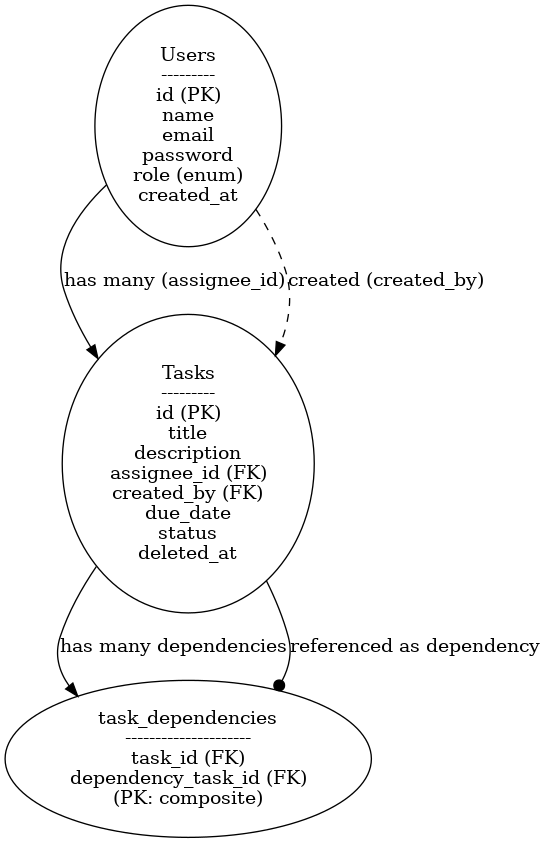

# Task Management API - SOFTXPERT

## Requirements
- PHP 8.2+
- Laravel 12
- MySQL / SQLite
- Composer

## Installation
1. git clone ...
2. cp .env.example .env
3. composer install
4. php artisan migrate --seed
5. php artisan serve

## Postman
You can import and test the API using the following [Postman Collection](docs/task_managment.postman_collection.json).

---

## 🧾 : API Documentation (Postman-style)

### ✅ **Authentication**

| Method | Endpoint           | Description                | Auth |
| ------ | ------------------ | -------------------------- | -- |
| POST   | `/api/auth/login`  | Login as a manager or user | ✅   |
| POST   | `/api/auth/logout` | Logout from session        | ✅  |
| GET    | `/api/auth/me`     | Get current user info      | ✅  |

---

### 📦 **Tasks**

| Method | Endpoint                       | Description                                                                       | Auth | Roles                          |
| ------ | ------------------------------ | --------------------------------------------------------------------------------- | ---- | ------------------------------ |
| GET    | `/api/tasks`                   | Get tasks list (filters: `status`, `due_date_from`, `due_date_to`, `assignee_id`) | ✅    | Manager: all tasks / User: own |
| GET    | `/api/tasks/{id}`              | Get a specific task with its dependencies                                         | ✅    | Both                           |
| POST   | `/api/tasks`                   | Create a new task (Manager only)                                                  | ✅    | Manager only                   |
| PUT    | `/api/tasks/{id}`              | Update task (Manager: full / User: only status)                                   | ✅    | Both                           |
| DELETE | `/api/tasks/{id}`              | Soft delete a task (Manager only)                                                 | ✅    | Manager only                   |
| POST   | `/api/tasks/{id}/dependencies` | Attach dependencies to task                                                       | ✅    | Manager only                   |

---

### 📥 **Validation Rules**

#### 🔐 `POST /api/auth/login`

```json
{
  "email": "required|email",
  "password": "required"
}
```

#### 🧾 `POST /api/tasks`

```json
{
  "title": "required|string|max:255",
  "description": "nullable|string",
  "assignee_id": "required|exists:users,id",
  "due_date": "required|date|after_or_equal:today",
  "dependencies": "nullable|array"
}
```

#### 🔄 `PUT /api/tasks/{id}`

```json
{
  "title": "sometimes|string|max:255",
  "description": "nullable|string",
  "due_date": "sometimes|date|after_or_equal:today",
  "assignee_id": "nullable|exists:users,id",
  "status": "sometimes|in:pending,completed,canceled"
}
```

#### ➕ `POST /api/tasks/{id}/dependencies`

```json
{
  "dependencies": "required|array|exists:tasks,id"
}
```

---

## 🧬 ERD – Entity Relationship Diagram

### 👥 Users Table

| Column      | Type     | Description         |
| ----------- | -------- | ------------------- |
| id          | bigint   | Primary Key         |
| name        | string   | User name           |
| email       | string   | Unique email        |
| password    | string   | Hashed password     |
| role        | enum     | `manager` or `user` |
| created\_at | datetime | —                   |

---

### ✅ Tasks Table

| Column       | Type     | Description                        |
| ------------ | -------- | ---------------------------------- |
| id           | bigint   | Primary Key                        |
| title        | string   | Task title                         |
| description  | text     | Task details                       |
| assignee\_id | bigint   | FK → users.id                      |
| created\_by  | bigint   | FK → users.id (manager)            |
| due\_date    | date     | Deadline                           |
| status       | enum     | `pending`, `completed`, `canceled` |
| deleted\_at  | datetime | Soft delete support                |

---

### 🔗 task\_dependencies Table

| Column               | Type   | Description                    |
| -------------------- | ------ | ------------------------------ |
| task\_id             | bigint | FK → tasks.id (main task)      |
| dependency\_task\_id | bigint | FK → tasks.id (dependent task) |

> 🔁 Composite primary key: `(task_id, dependency_task_id)`

---

## 📊 ERD Visualization (Textual)

```
users
 └── id (PK)
     └──┐
tasks   |
 └── assignee_id (FK → users.id)
 └── created_by (FK → users.id)
 └── id (PK)
     └──────┐
task_dependencies
 └── task_id (FK → tasks.id)
 └── dependency_task_id (FK → tasks.id)
```

## Entity Relationship Diagram (ERD)




---
* ✅ **Sanctum** is used for stateless token-based auth.
* 🎯 **Role-based logic** handled in `UpdateTaskRequest::authorize()`.
* 📡 **Events & Listeners** for future async processing (e.g., `TaskCompleted`).
* 🧠 Business Logic in `TaskService` — cleanly separated from controller.

---
